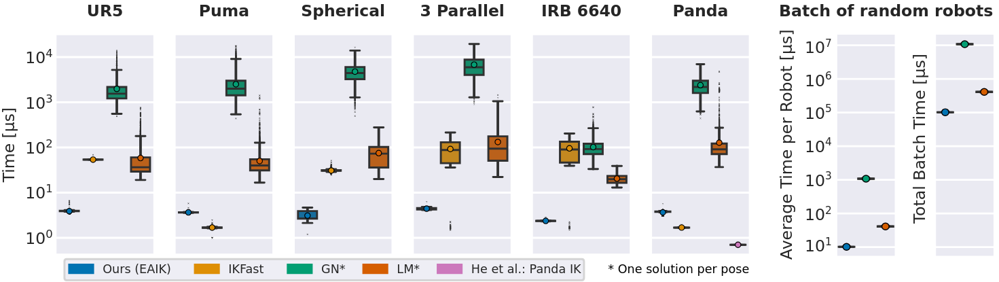
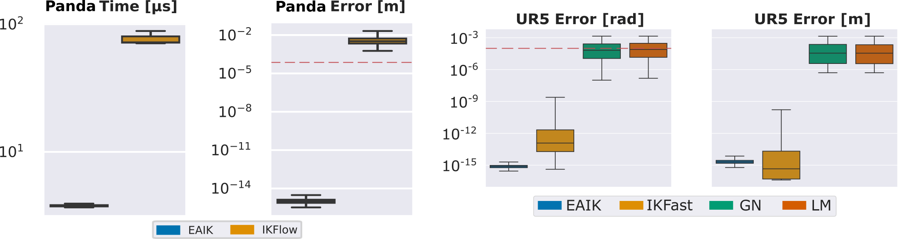

<h1>
  
  
  <br>
  Automatic Geometric Decomposition for Analytical Inverse Kinematics
  <br>
</h1>

**Authors:** Daniel Ostermeier,
Jonathan Külz and Matthias Althoff<br><br>
[](https://arxiv.org/abs/2409.14815)<br>


Feel free to contact us if you have any questions or suggestions:
daniel.sebastian.ostermeier@tum.de<br>
Or open up a [GitHub issue](https://github.com/OstermD/EAIK/issues).
## Overview
Calculating the inverse kinematics (IK) is fundamental for motion planning in robotics. Compared to numerical
or learning-based approaches, analytical IK provides higher
efficiency and accuracy. 

However, existing analytical approaches
require manual intervention, are ill-conditioned, or rely on time consuming symbolic manipulation. In this paper, we propose a
fast and stable method that enables automatic online derivation
and computation of analytical inverse kinematics. 

Our approach
is based on remodeling the kinematic chain of a manipulator
to automatically decompose its IK into pre-solved geometric
subproblems. We exploit intersecting and parallel joint axes
to assign a given manipulator to a certain kinematic class
and the corresponding subproblem decomposition.

Following this one-time derivation, our method matches and even surpasses baselines, such
as [IKFAST](https://docs.ros.org/en/kinetic/api/moveit_tutorials/html/doc/ikfast/ikfast_tutorial.html), in terms of speed and accuracy during the online
computation of explicit IK solutions. We provide a C++
toolbox with Python wrappers that, for the first time, enables
plug-and-play analytical IK within less than a millisecond.
This software is available via our [Open-Source Implementation](https://github.com/OstermD/EAIK), and as a [PyPI Package](https://pypi.org/project/EAIK/).

<figure figcaption align="center">
  
  <figcaption>A robot with a spherical wrist and the geometric representation of a
subproblem we use to solve parts of its IK. Red points indicate a unit offset
along the corresponding joint axes from the intersection point. The circles
represent rotations of these offset vectors about the joint axes 4 and 5 by
the solution angles θ4,5 and θ′
4,5, which are determined by the intersection
points of the two circles (black dots).
  </figcaption>
</figure>

<br>

<figure figcaption align="center">
  
  <figcaption>Geometrical correspondences of the first two subproblems on the example of a simple planar manipulator.
  This figure aims to emphasize the geometric meaning and does not showcase how the subproblems are applied in reality.
  Coplanar axes can pose an issue when combined with subproblem 2 if not accounted for.
  </figcaption>
</figure>

The current implementation supports automatic derivation of solutions for the following 6R and 3R manipulators, as well as their mirrored version (switched base and endeffector).
In addition, we allow the user to solve arbitrary nR manipulators that, by locking individual joints, corrspond to one of the below kinematic families.

<br>
<figure figcaption align="center">
  
  <figcaption>Robot configurations (without their mirrored version) that can be solved by the current EAIK implementation. NR-Robots that contain these structures as kinematic subchains are solvable if the leftover redundant joints are locked in place. </figcaption>
</figure>

<br>
We implement an user friendly interface for parametrizing a robot by a URDF file, DH parameters, or simply the homogeneous transformations that correspond to the joint axes placements.

The following figure shows an overview of our interface and a superficial showcase of our method:

<figure figcaption align="center">
  
</figure>

If you require a vast amount of IK problems to be computed at once, we also implement a multithreaded batched version that allows you to make full use of your processor.

## Installation
## Dependencies and Installation
We use [Eigen 3.4](https://eigen.tuxfamily.org/index.php?title=Main_Page) for a fast implementation of the linear algebra operations within this toolbox.
Make sure you have your Eigen headers placed in their standard directory ('/usr/include/eigen3', '/usr/local/include/eigen3') - otherwise the following step will not work for you.

We suggest using our pip-installable [PyPI package](https://pypi.org/project/EAIK/#description). Simply use the following command on your Linux machine:

```
pip install EAIK
```

<br>

If you want to directly use the C++ functionality as a library and skip the Python wrapper, simply clone our [GitHub Repository](https://github.com/OstermD/EAIK) and follow the following steps.


Make sure to clone the external dependencies of this library using:
```
$ git clone --recurse-submodules git@github.com:OstermD/EAIK.git
```
Then build the EAIK C++ library by using:

```
$ mkdir EAIK/CPP/src/build && cd EAIK/CPP/src/build
$ cmake ..
$ make
```


## Usage Example
We currently provide support parametrizing a robot via DH parameters, homogeneous transformations of each joint in zero-pose with respect to the basis, as well as [ROS URDF](http://wiki.ros.org/urdf) files.
Some quick examples that demonstrate the usability of our implementation are shown in the following code-snippets:

#### URDF
```python
import numpy as np
from eaik.IK_DH import Robot

"""
Example DH parametrization + forward kinematics for a random robot kinematic
"""

d = np.array([0, 0, 0, 0.56426215, 0.31625527, 0])
alpha = np.array([np.pi/2, -np.pi/2, 0, np.pi/2, np.pi/2, 0])
a = np.array([0, 0.6766692, 0.93924826, 0.99652755, 0, 0.9355382])
bot = Robot(alpha, a, d)

print(bot.hasKnownDecomposition())
print(bot.fwdKin(np.array([1,1,1,1,1,1])))

```

#### Robot from a URDF file and IK on random poses
```python
import numpy as np
import random
from eaik.IK_URDF import Robot
import evaluate_ik as eval

def urdf_example(path, batch_size):
    """
    Loads spherical-wrist robot from urdf, calculates IK using subproblems and checks the solution for a certian batch size
    """

    bot = Robot(path)

    # Example desired pose
    test_angles = []
    for i in range(batch_size):
        rand_angles = np.array([random.random(), random.random(), random.random(), random.random(), random.random(),random.random()])
        rand_angles *= 2*np.pi
        test_angles.append(rand_angles)
    poses = []

    for angles in test_angles:
       poses.append(bot.fwdKin(angles))
        
    for pose in poses:
        ik_solutions = bot.IK(pose)

        # Print forward kinematics for all solutions
        for Q in ik_solutions.Q:
            pose_fwd = bot.fwdKin(Q)
            print(pose_fwd)
```
Even more examples for the python interface are available [here](https://github.com/OstermD/EAIK/tree/main/src/eaik/examples).

#### Using the C++ Library
The example below is just a small code snipped. As the C++ code quickly becomes more evolved, we recommend to look into the [Software Tests](https://github.com/OstermD/EAIK/tree/main/CPP/Tests) we wrote for the C++ side. 
The code there can also be used as an example on how you can use our library in a bigger project that, e.g., requires checks for least-square solutions etc.

```C
#include <eigen3/Eigen/Dense>
#include <vector>

#include "EAIK.h"

const Eigen::Vector3d zv(0, 0, 0);
const Eigen::Vector3d ex(1, 0, 0);
const Eigen::Vector3d ey(0, 1, 0);
const Eigen::Vector3d ez(0, 0, 1);

double rand_angle(); // Just some random angle in [0; 2pi)

void ik_7R_KUKA_R800()
{
  // Robot configuration for KUKA LBR iiwa 7 R800

  // Define axes unit vectors
  Eigen::Matrix<double, 3, 7> H;
  H << ez, ey, ez, -ey, ez, ey, ez;

  // Define offsets between reference points on joint axes
  Eigen::Matrix<double, 3, 8> P;
  P << (0.15 + 0.19) * ez, 
        zv, 0.21 * ez, 
        0.19 * ez, 
        (0.21 + 0.19) * ez, 
        zv, 
        zv, 
        (0.081 + 0.045) * ez;

  // Kuka R800 with q3 locked in random configuration
  double q3_angle = rand_angle();

  // Create Robot
  EAIK::Robot kukaR800(H, P, 
                        Eigen::Matrix<double, 3, 3>::Identity(), 
                        {std::pair<int, double>(2, q3_angle)});

  // Forward Kinematics
  IKS::Homogeneous_T ee_pose = kukaR800.fwdkin(std::vector{
      rand_angle(), 
      rand_angle(),
      q3_angle, 
      rand_angle(), 
      rand_angle(), 
      rand_angle(), 
      rand_angle()
      });
  
  // Inverse Kinematics
  IKS::IK_Solution solution = robot.calculate_IK(ee_pose);
}

void main()
{
  ik_7R_KUKA_R800();
}
```

Again, if you are stuck somewhere or have open questions feel free to reach out to us.

## Performance
>**_NOTE:_** All of the following experiments were conducted on a computer with an AMD Ryzen 7 8-core processor and 64GB of DDR4 memory within Ubuntu 22.04.

We compare our method, i.e., the EAIK toolbox, to
different frameworks on common 6R manipulators: The UR5 robot (three parallel and two intersecting axes), the Puma
(spherical wrist and two intersecting axes), and the ABB IRB
6640 (spherical wrist and two parallel axes).
A Franka Emika Panda (spherical wrist) represents the category of redundant 7R robots, which we solve by joint-locking. We further
use two conceptual manipulators from [Elias et al.](#credits): The “Spherical”
(spherical wrist) and “3-Parallel” (three parallel axes) robot.
Besides IKFast, we also list the computation times on the numerical Gauss-Newton
(GN) and Levenberg-Marquard (LM) solvers implemented
in the [Python Robotics Toolbox](https://github.com/petercorke/robotics-toolbox-python). 

The following figure shows a comparison of the IK computation times of above-mentioned manipulators on 5,000 randomly assigned end effector poses (left) and the batch-times
on 10,000 random (analytically solvable) manipulators (right). The measured times in (left) correspond to a single solution for the numerical approaches and
the set of all possible solutions for EAIK and IKFast, respectively. In the right image, we additionally include derivation times and only show our method along the
numerical ones, as the derivation time of IKFast deemed it unfeasible for this task. Our method shows the smallest overall variance and, except for the
Puma robot, consistently surpasses all other methods.
<figure figcaption align="center">
  
  <figcaption></figcaption>
</figure>

Further, we randomly generate 20 different 6R manipulators with their last three joints resembling a spherical wrist.
The chosen manipulators cover all decisive combinations of intersecting or parallel axes relevant to our current decomposition.
For these manipulators, the input to our method is a series of six homogeneous transformations that describe the position and orientation of the respective joints.
The time measurements were obtained by running a batch size of 100'000 derivations.

<figure figcaption align="center">
  
  <figcaption>IK derivation (left) and computation times (right)</figcaption>
</figure>

We further compare our method to one of the current state-of-the-art methods for general analytical IK computation: [*IKFAST*](https://docs.ros.org/en/kinetic/api/moveit_tutorials/html/doc/ikfast/ikfast_tutorial.html).
We use five typical industrial 6R manipulators that comply with the Pieper criteria. The UR5 robot (three parallel and two intersecting axes), the Puma (spherical wrist and two intersecting axes), and the IRB 6640 (spherical wrist and two parallel axes) resemble real-world manipulators.
The Spherical (spherical wrist) and 3-Parallel (three parallel axes) robots, on the other hand, are made up by [Elias et al.](#credits)
The input to our implementation is an [*URDF*](https://wiki.ros.org/urdf) file that contains the manipulator's structure.
The input to IKFast is an equivalent [*COLLADA*](https://www.khronos.org/api/collada) XML file.

<figure figcaption align="center">
  
  <figcaption>Table: IK-derivation times of IKFast and our method
</figcaption>
</figure>

We compare our approach to the learning-based approach
[*IKFlow*](https://github.com/jstmn/ikflow) by the 7R Franka Panda robot. As this robot
is inherently redundant, we need to set one joint angle in
advance (i.e., use joint locking) to solve the Panda robot
analytically, while IKFlow is able to make use of all seven
joints. Our experiments show a mean computation time of
75.07 μs for IKFlow (7507 μs per batch - IKFlow performs batched computation for 100 poses simultaneously) and 3.67 μs for our
method. However, by employing joint locking,
we can not sample from the same infinite solution space that
IKFlow makes use of, which leads to less diverse solutions.

The following figure shows the just mentioned values for the Panda robot, as well as the position and orientation errors that different methods resulted for non-redundant UR5 robot. 
<figure figcaption align="center">
  
  <figcaption>Computation times and position error for the Panda robot, as well as the UR5. The dashed red lines
indicates the repeatability precision of the robot according to its datasheet.</figcaption>
</figure>

## Accuracy
To further evaluate our implementation's accuracy, we sample 100 random poses throughout the workspace of a representative subset of the above mentioned manipulators.
We calculate the error metric of each solution by the Frobenius norm of the difference between the homogeneous transformation of our IK's result and the ground truth, i.e., the sum of the squared differences between the entries in the matrices.

<figure figcaption align="center">
  
  <figcaption>Panda computation times and Error metric across 100 poses for three representative manipulators</figcaption>
</figure>


We further create 10'000 resampled bootstrap distributions (each 100 samples) and calculate their respective means.
The means of these resamplings, together with a bias corrected and accelerated ([B. Efron](#credits)) 95\% confidence interval, are visualized in the following figures:
<figure figcaption align="center">
  
</figure>

## Credits
We adopt the solutions and overall canonical subproblem set from [Elias et al.](https://arxiv.org/abs/2211.05737):<br>
A. J. Elias and J. T. Wen, “Ik-geo: Unified robot inverse kinematics
using subproblem decomposition” arXiv:2211.05737, 2024<br>
Check out their publication and [implementation](https://github.com/rpiRobotics/ik-geo).

[*IKFAST*](https://docs.ros.org/en/kinetic/api/moveit_tutorials/html/doc/ikfast/ikfast_tutorial.html) - the analytical solver that we compare our implementation to - is part of the work of:<br>
R. Diankov. “Kinematics and Control of Robot Manipulators”. PhD thesis. Carnegie Mellon University Pittsburgh, Pennsylvania, 2010

[*IKFlow*](https://github.com/jstmn/ikflow) - the learning-based solver that we compare our implementation to - is part of the work of: B. Ames, J. Morgan, and G. Konidaris, “IKFlow: Generating diverse
inverse kinematics solutions,” IEEE Robotics and Automation Letters,
vol. 7, no. 3, 2022.

[Python Robotics Toolbox](https://github.com/petercorke/robotics-toolbox-python) - the toolbox we use to compare our implementation to numerical solvers - is part of the work of:
P. Corke and J. Haviland, “Not your grandmother’s toolbox–the
robotics toolbox reinvented for Python,” in Proc. of the IEEE Int.
Conf. on Robotics and Automation (ICRA), 2021, pp. 11 357–11 363

B. Efron. "Better Bootstrap Confidence Intervals". Journal of the American Statistical Association. Vol. 82, No. 397: 171–185, 1987

