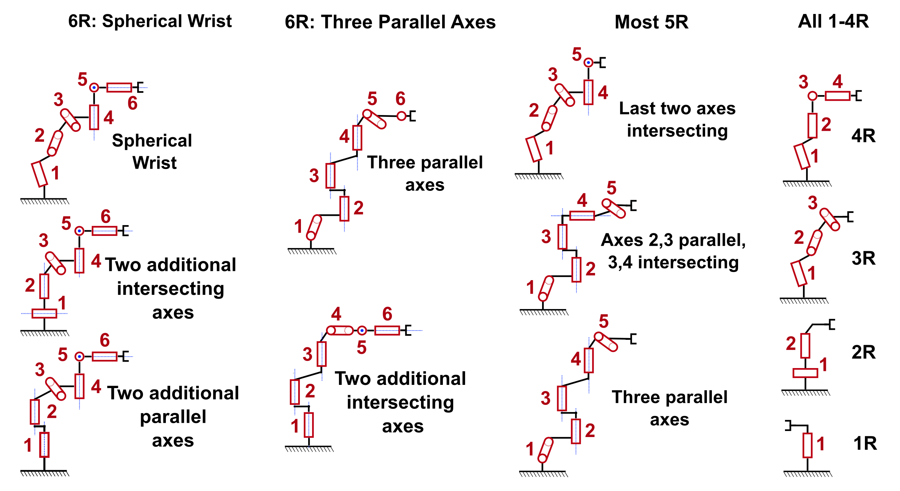

# EAIK: A Toolbox for Efficient Analytical Inverse Kinematics by Subproblem Decomposition
## Overview
This code resembles the C++ implementation of the [EAIK Python toolbox](https://pypi.org/project/EAIK/). Please visit our [Website](https://eaik.cps.cit.tum.de) for further informations.

With this toolbox, we propose a method for automatic inverse kinematic derivation.
We exploit intersecting and parallel axes to remodel a manipulator's kinematic chain.

This allows for a hard-coded decomposition algorithm to solve its inverse kinematics by employing pre-solved subproblems.
Our approach surpasses current analytical methods in terms of usability and derivation speed without compromising computation time or the completeness of the overall solution set.

<figure figcaption align="center">
  
  <figcaption>Geometrical correspondences of the first two subproblems on the example of a simple planar manipulator</figcaption>
</figure>

We adopt the solutions and overall canonical subproblem set from [Elias et al.](https://arxiv.org/abs/2211.05737): 
A. J. Elias and J. T. Wen, “Ik-geo: Unified robot inverse kinematics
using subproblem decomposition” arXiv:2211.05737, 2024 
Please check out their publication and [implementation](https://github.com/rpiRobotics/ik-geo).

## Solvable Manipulators
The current implementation supports solutions for the following 6R manipulators:
<figure figcaption align="center">
  
  <figcaption>Robot configurations that can be solved by the current EAIK implementation</figcaption>
</figure>

Additionally, we are able to solve all 3R manipulator chains.

## Usage
Currently, this C++ implementation is solely used in combination with a Python wrapper to read and process URDF files as demonstrated on our [Website](eaik.cps.cit.tum.de).

If you want to directly use the C++ functionality and skip the Python wrapper, feel free to use the EAIK:Robot() class.
This class receives two parameters: H and P.

H represents an Eigen MatrixXd with the columns corresponding to the unit vectors of each joint with respect to a global basis frame.

P represents an Eigen MatrixXd with the columns corresponding to the link-offsets.
P.col(i) therefore represents the offset between joint i and i+1 with the same orientation as the global basis frame.
This convention is consistent with that of [Elias et al.](https://github.com/rpiRobotics/ik-geo)

## Dependencies
We use [Eigen](https://eigen.tuxfamily.org/index.php?title=Main_Page) for a fast implementation of the linear algebra operations within this toolbox.
After setting up Eigen, you can use cmake to build this project.

## Q&A
Feel free to open up a GitHub issue or a pullrequest if you have any suggestions or questions.
This project is still in development.