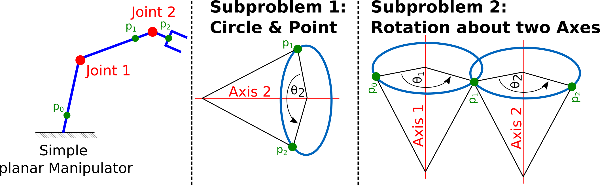
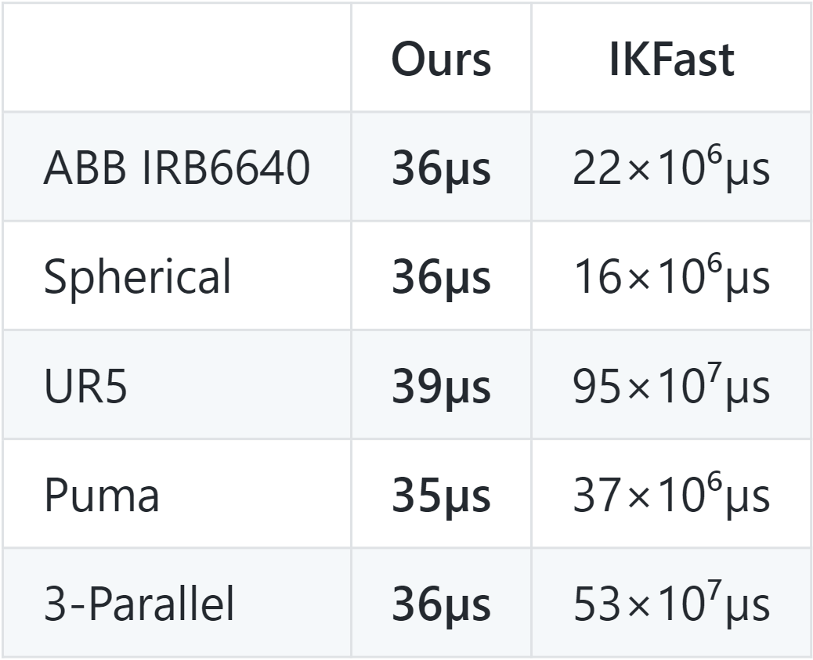

<h1>
  
  
  <br>
  EAIK:
  <br>
  A Toolbox for Efficient Analytical Inverse Kinematics

</h1>

**Authors:** Daniel Ostermeier and
Jonathan Külz <br><br>
Feel free to contact us if you have any questions or suggestions:
daniel.sebastian.ostermeier@tum.de<br>
Or open up a [GitHub issue](https://github.com/OstermD/EAIK/issues).
## Installation
Our toolbox is currently available for Python>=3.8 on Linux machines with [Eigen3](https://eigen.tuxfamily.org/dox/GettingStarted.html) in the default install directories.<br>
To install our [Python Toolbox](https://pypi.org/project/EAIK/), simply run:
```
pip install EAIK
```

## Usage Example
We currently provide support for CSV files containing the homogeneous transformations of each joint in zero-pose with respect to the basis, as well as [ROS URDF](http://wiki.ros.org/urdf) files.
See our [PyPI Project](https://pypi.org/project/EAIK/) for more elaborate examples.
A quick example that demonstrates the usability of our implementation is shown in the following Python code-snippet:

#### URDF
```python
import numpy as np
from eaik.IK_URDF import Robot

def example_urdf(path, batch_size):

    bot = Robot(path)

    # Example desired pose
    example_angles = np.array([0, 1, np.pi/2, 0, 1, np.pi])
    poses = bot.fwdKin(example_angles)

    ik_solution = bot.IK(pose)
        
example_urdf("../tests/UR5.urdf")
```

## Overview
The problem of calculating the inverse kinematics appears for any manipulator with arbitrary degrees of freedom.
This problem might have exactly one, multiple, infinite, or no solution at all depending on the number of joints, their types, and their respective placement (i.e., the manipulator's joint configuration).

Due to this characteristic of the inverse kinematic problem, the existence of a closed-form solution is not guaranteed.
Current methods for general closed-form derivation comprise the above-mentioned requirements in their final solution (given a solvable manipulator) but suffer from complex setup procedures.
With this toolbox, we propose a method for automatic inverse kinematic derivation.
We hereby exploit intersecting and parallel axes to remodel a manipulator's kinematic chain.

This allows for a hard-coded decomposition of its inverse kinematics into pre-solved subproblems.
Our approach surpasses current analytical methods in terms of usability and derivation speed without compromising computation time or the completeness of the overall solution set.

<figure figcaption align="center">
  
  <figcaption>Geometrical correspondences of the first two subproblems on the example of a simple planar manipulator</figcaption>
</figure>

An implementation of our method is made available as an [Open-Source Implementation](https://github.com/OstermD/EAIK), of a [Python Toolbox](https://pypi.org/project/EAIK/) that allows automatic analytical IK derivation and computation for a large set of manipulators.
In contrast to other general solvers, our implementation doesn't rely on symbolic manipulation and, therefore, surpasses the derivation speed of these methods by several magnitudes.
This allows the application of analytical IK in scenarios where both quick and accurate IK derivation and computation are essential - such as modular robotics - which are currently dominated by numeric solvers.

The current implementation of our method (V0.0.1) allows us to analytically derive the IK of the following manipulator-families:


<figure figcaption align="center">
  
  <figcaption>Robot configurations that can be solved by the current EAIK implementation</figcaption>
</figure>

>**_NOTE:_**  While the current implementation of EAIK (V0.0.1) is able to solve all possible invariances of the spherical wrist robots, only a subset of manipulators with three parallel axes are solvable as of now.

The next version of EAIK is currently under development and will implement solutions for:

* **6R Manipulators with arbitrary 3 axes in parallel**
* **All 3R manipulators**

## Performance
>**_NOTE:_** All of the following experiments were conducted on a computer with an AMD Ryzen 7 8-core processor and 64GB of DDR4 memory within Ubuntu 22.04.

For a performance overview of our method, we randomly generate 20 different 6R manipulators with their last three joints resembling a spherical wrist.
The chosen manipulators cover all decisive combinations of intersecting or parallel axes relevant to our current decomposition.
For these manipulators, the input to our method is a series of six homogeneous transformations that describe the position and orientation of the respective joints encoded in a *.csv* file.
The time measurements were obtained by running a batch size of 100'000 derivations.

<figure figcaption align="center">
  
  <figcaption>IK derivation (left) and computation times (right)</figcaption>
</figure>

We further compare our method to one of the current state-of-the-art methods for general analytical IK computation: [*IKFAST*](https://docs.ros.org/en/kinetic/api/moveit_tutorials/html/doc/ikfast/ikfast_tutorial.html).
We use five typical industrial 6R manipulators that comply with the Pieper criteria. The UR5 robot (three parallel and two intersecting axes), the Puma (spherical wrist and two intersecting axes), and the IRB 6640 (spherical wrist and two parallel axes) resemble real-world manipulators.
The Spherical (spherical wrist) and 3-Parallel (three parallel axes) robots, on the other hand, are made up by [Elias et al.](#credits)
The input to our implementation is an [*URDF*](https://wiki.ros.org/urdf) file that contains the manipulator's structure.
The input to IKFast is an equivalent [*COLLADA*](https://www.khronos.org/api/collada) XML file.

<figure figcaption align="center">
  
  <figcaption>Table: IK-derivation times of IKFast and our method
</figcaption>
</figure>
<br>
<figure figcaption align="center">
  
  <figcaption>Comparing IK computation times of our method and IKFFast</figcaption>
</figure>

## Accuracy
To evaluate our implementation's accuracy, we sample 100 random poses throughout the workspace of a representative subset of the above mentioned manipulators.
We calculate the error metric of each solution by the Frobenius norm of the difference between the homogeneous transformation of our IK's result and the ground truth, i.e., the sum of the squared differences between the entries in the matrices.

<figure figcaption align="center">
  
  <figcaption>Error metric across 100 poses for three representative manipulators</figcaption>
</figure>


We further create 10'000 resampled bootstrap distributions (each 100 samples) and calculate their respective means.
The means of these resamplings, together with a bias corrected and accelerated ([B. Efron](#credits)) 95\% confidence interval, are visualized in the following figures:
<figure figcaption align="center">
  
</figure>

## Credits
We adopt the solutions and overall canonical subproblem set from [Elias et al.](https://arxiv.org/abs/2211.05737):<br>
A. J. Elias and J. T. Wen, “Ik-geo: Unified robot inverse kinematics
using subproblem decomposition” arXiv:2211.05737, 2024<br>
Check out their publication and [implementation](https://github.com/rpiRobotics/ik-geo).

[*IKFAST*](https://docs.ros.org/en/kinetic/api/moveit_tutorials/html/doc/ikfast/ikfast_tutorial.html) - the analytical solver that we compare our implementation to - is part of the work of:<br>
R. Diankov. “Kinematics and Control of Robot Manipulators”. PhD thesis. Carnegie Mellon University Pittsburgh, Pennsylvania, 2010


B. Efron. "Better Bootstrap Confidence Intervals". Journal of the American Statistical Association. Vol. 82, No. 397: 171–185, 1987

